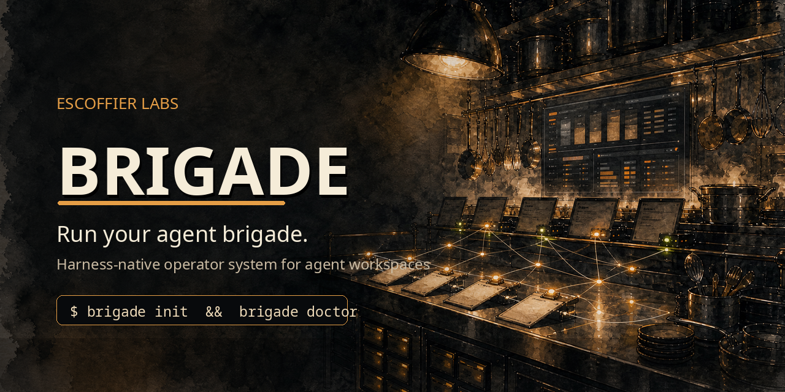

<p align="center">
  
</p>

<h1 align="center">Brigade</h1>

<p align="center">
  <strong>Run your agent brigade.</strong>
</p>

<p align="center">
  <em>Public-safe workspace bootstrap, memory handoffs, and publish guards for real agent setups.</em>
</p>

<p align="center">
  
  
  
  
</p>

<p align="center">
  <code>brigade</code> is the operator-system CLI for agent workspaces. It gives you the workspace skeleton, handoff inbox, conservative ingester, and publish guards that make a multi-agent setup usable without leaking private junk into public repos.
</p>

## What this is

Mise en place means "everything in its place before the work starts." In a kitchen, that is chopped mirepoix, clean pans, labels, and a station that does not make you hunt for salt & butter mid-service. For agents, it is the same idea: rules, memory, tools, handoff inboxes, publish guards, and boring verification already laid out before the session gets expensive.

This package lays down a clean starting point for an agent workspace or a repo that needs durable memory handoffs. It is meant for people running real tools, real docs, and real automation across OpenClaw, Claude Code, Codex, Hermes, or a similar harness.

The cookbook explains the why. This package gives you the kitchen.

## What you get

- sanitized bootstrap files for agent behavior, safety, tools, identity, and memory
- a canonical memory layout where one configured owner holds durable knowledge
- writer-specific Memory Handoff inboxes, such as `.claude/memory-handoffs/` for Claude Code and `.codex/memory-handoffs/` for Codex
- starter memory cards and routing rules
- multi-workspace handoff patterns for people administering more than one agent setup
- memory-care staleness checks so durable cards do not quietly rot
- TokenJuice output-compaction guidance for Claude Code and Codex, including wrapper notes and savings expectations
- content-guard publish gates so private infrastructure does not leak into public docs
- adapter fragments for OpenClaw (tested), Hermes (stubbed), and generic harnesses
- doctor checks that prove the system is wired before you trust it

Browse the public template index in [`templates/`](templates/). The installable source files live under `src/brigade/templates/`; root workspace files are local dogfood state and stay ignored.

## What you do not get

- private hostnames, IPs, account IDs, or personal details
- live auth profiles or OAuth tokens
- cron jobs that post publicly by default
- destructive automation or write-enabled integrations without explicit opt-in

## Install

```bash
pipx install brigade-cli
```

Or, to track `main`:

```bash
pipx install git+https://github.com/escoffier-labs/brigade
```

The workspace config directory is `.brigade` (older `.solo-mise` installs are still read), and the `solo-mise` command is a deprecated alias for `brigade`.

## Quick path

Run `brigade init` with no flags for the interactive picker:

```bash
brigade init --target ~/agent-kitchen
```

For CI or scripts, pass flags directly:

```bash
brigade init --target ~/agent-kitchen --depth workspace --harnesses claude,codex,openclaw
brigade init --target ./repo --depth repo --harnesses codex
brigade init --target ./repo --harnesses none           # generic install
```

Once installed, `brigade doctor` verifies the wiring and `brigade status` reports over the station registry.

## Run a brigade

`brigade run "<task>"` is the aboyeur path: one orchestrator plans the work, Brigade dispatches the assigned workers through their own CLIs, then the orchestrator synthesizes the final answer. It is intentionally bounded: two orchestrator calls plus the worker calls in the plan.

Start with a roster:

```bash
brigade roster init
brigade roster doctor
```

That writes `.brigade/roster.toml` with a Codex orchestrator, a Codex coder, and an optional Ollama local researcher:

```toml
orchestrator = "chef"

[agents.chef]
cli = "codex"
role = "Plan the work, choose useful workers, and synthesize the final answer."

[agents.local_researcher]
cli = "ollama:llama3.3"
role = "Research locally and summarize useful findings."
timeout_seconds = 300

[agents.coder]
cli = "codex"
role = "Make precise code changes and report what changed."

[limits]
max_workers = 4
timeout_seconds = 600
allow_models = ["codex", "ollama:*"]
```

Edit the roles, CLI refs, and timeouts to match the tools on your machine. `limits.timeout_seconds` is the default per-agent timeout; `agents.<name>.timeout_seconds` overrides it for one agent. Then run:

```bash
brigade run "review this repo and suggest the next implementation step"
brigade run "plan the migration" --dry-run
brigade run "review this repo" --show-plan
brigade run "review this repo" --verbose
brigade run "review this repo" --cwd /path/to/repo
brigade run "review this repo" --handoff
brigade run "review this repo" --read-only
brigade run "review this repo" --read-only --inspect
brigade dogfood init --target /path/to/repo
brigade dogfood status
brigade dogfood
brigade dogfood next
brigade dogfood --target /path/to/repo
brigade work bootstrap
brigade work status
brigade work doctor
brigade work resume
brigade work brief
brigade work brief --json
brigade work next
brigade work next --json
brigade work tasks
brigade work task add "build the next slice"
brigade work task add --from-next
brigade work task done <task-id>
brigade work run
brigade work run --queue-next
brigade work run "review today's changes"
brigade work start "next slice"
brigade work note "wired parser and tests"
brigade work end --note "tests passed" --handoff
brigade work list
brigade work latest
brigade work recap --since 2026-05-26
```

`--dry-run` prints the planned assignments as JSON and stops before worker dispatch. `--show-plan` prints assignments before a normal run. `--verbose` prints the plan, worker statuses, and synthesis status. `--cwd` sets the working directory for the agent CLI calls and defaults to the current directory. `--handoff` writes a Memory Handoff for a successful non-dry run. `--inspect` prints the same readable artifact summary as `brigade runs show` after the run completes. `--read-only` tells the orchestrator and workers to inspect and recommend only, without modifying files or external state. For `codex` agents, Brigade also passes `codex exec --sandbox read-only`; other adapters receive the prompt policy only. The `cli` values are adapters for installed command-line tools: `codex`, `claude`, and `ollama:<model>`. Pick the ones you already use. Brigade shells out to those tools and keeps no provider keys. `brigade roster doctor` validates the roster syntax and reports which CLIs are present on `PATH`.

`brigade dogfood` is the shortcut for using Brigade on itself or another trusted repo. It uses a built-in Codex-only roster, runs with prompt-level read-only instructions, shows the plan, writes normal run artifacts, writes a Memory Handoff by default, and prints the artifact summary afterward. Run `brigade dogfood init --target /path/to/repo` once to write local defaults to `.brigade/dogfood.toml`; that file is gitignored because it captures machine-local paths and preferences. New dogfood configs default the handoff inbox to `.codex/memory-handoffs/` under the target because the dogfood roster is Codex-driven; pass `--handoff-inbox` if your memory owner ingests a different path, including existing `.claude/memory-handoffs/` setups. After that, `brigade dogfood` from the repo is the one-command daily path, and `brigade dogfood "review today's changes"` overrides only the task. Use `brigade dogfood status` to inspect the effective target, artifact paths, handoff path, sandbox mode, CLI availability, ignore rules, and latest run without starting a new orchestration. Use `brigade dogfood latest` to show the latest configured dogfood run, and `brigade dogfood next` to print the latest extracted next step. Dogfood writes a `summary.md` beside each run's JSON artifacts with the final answer and extracted next step when present. Dogfood defaults to a 600 second per-agent timeout because full repo review can exceed short smoke-test limits. By default it passes Codex's `danger-full-access` sandbox setting for trusted-workspace use so repo inspection works on hosts where native read-only sandboxing blocks shell inspection. Use `--no-handoff` or `--no-inspect` to turn off those last two steps. Use `--native-read-only-sandbox` when the host supports Codex's native read-only sandbox and you want that additional enforcement.

CLI runs write artifacts by default under `.brigade/runs/<id>` below `--cwd`; dogfood runs use `.brigade/runs/<id>` below the configured target:

| File | Contents |
|---|---|
| `run.json` | task, cwd, orchestrator, mode flags, status, artifact path, handoff path, timestamps, and duration |
| `roster.json` | effective orchestrator, agents, limits, allow-list, and timeouts |
| `plan-attempts.json` | raw planner outputs, parse status, and parse errors from initial/correction attempts |
| `plan.json` | parsed worker assignments |
| `worker-results.json` | worker status, details, and text output for non-dry runs |
| `synthesis.json` | orchestrator synthesis status, detail, and raw text for non-dry runs |
| `final.txt` | final synthesized answer for non-dry runs |
| `summary.md` | dogfood summary with run metadata, final answer, and extracted next step when present |

Use `--output-dir <path>` to pick the artifact directory, or `--no-artifacts` for a throwaway run.

Use `brigade work bootstrap` once in a repo to initialize the daily loop: it writes or verifies `.brigade/dogfood.toml`, creates local run and work artifact directories, creates the configured handoff inbox, updates the managed `.gitignore` block, and reports whether the repo is ready to run. Use `brigade work brief` as the normal start-of-day command. It shows branch and dirty-file state, active and latest work sessions, pending local tasks, latest dogfood run, extracted next task, recent sessions, and the command to continue; add `--json` for wrappers. Use `brigade work tasks` to list the local task ledger stored in `.brigade/work/tasks.json`, `brigade work task add "..."` to queue work manually, `brigade work task add --from-next` to promote the latest extracted dogfood next step, and `brigade work task done <task-id>` to close queued work. Use `brigade work status` as the quick daily dashboard for a repo. It reports the current branch, dirty files, dogfood readiness, configured dogfood paths, latest dogfood run, and extracted next step without starting a new orchestration. Use `brigade work doctor` to check whether the repo is ready for the daily loop: dogfood config, Codex CLI, local artifact paths, handoff inbox, ignore coverage, and latest run context. Use `brigade work resume` when returning to a repo; it shows the active or latest work session, latest dogfood run, extracted next step, and the suggested command to continue. Use `brigade work next` when you only need the task Brigade would run next, or `brigade work next --json` for wrappers that want the active session, dogfood snapshot, resolved task, and suggested command as structured output. `brigade work run` is the one-command daily loop: it starts a work session, consumes the oldest pending ledger task when no task is passed, otherwise uses the latest extracted dogfood next step, runs `brigade dogfood`, marks consumed ledger tasks done after successful runs, ends the session, writes a work-session Memory Handoff by default, and prints a compact recap. Add `--queue-next` to queue the successful run's extracted next step for the next session; duplicate pending task text is reused instead of added again. Pass a task to override the resolved next step, `--title` to name the session, `--no-handoff` to skip the work handoff, or `--dogfood-handoff` to also let the underlying dogfood run write its own handoff. `brigade work start "title"` opens a local work session under `.brigade/work/<id>/`, records the starting git and dogfood context, and writes `start.md`. `brigade work note "checkpoint"` appends a timestamped note to the active session without ending it. `brigade work end --note "what happened"` closes the active session, records ending context, and writes `end.md`. Add `--handoff` to also write a Memory Handoff for the closed session; it defaults to the configured dogfood handoff inbox or `.codex/memory-handoffs`.

Memory and bootstrap readiness are part of the same operating-system health story. `brigade doctor` checks installed bootstrap files against built-in hard byte budgets so overgrown files fail before agents load truncated context. It also checks `memory/cards/*.md` budgets, verifies that `MEMORY.md` card links resolve under `memory/cards/`, and reports memory-care freshness from `memory/cards/decay/scan-latest.json`. Workspace installs include `.brigade/memory-care.example.json` as a scanner wiring contract for whatever scheduler or memory owner produces the decay files. Missing memory-care decay state is advisory for fresh installs, but corrupt scan or refresh-queue JSON fails once the loop is wired. Bootstrap truncation is treated as a hard failure to prevent, not a cosmetic warning; keep cards atomic and bootstrap files as slim indexes.

Inspect local work sessions with `brigade work list`, `brigade work latest`, or `brigade work show <session-id-or-path>`. Use `brigade work recap` for a compact summary of recent sessions, or add `--since YYYY-MM-DD` for a day-range recap.

Inspect a completed run without opening each JSON file:

```bash
brigade runs list --cwd /path/to/repo
brigade runs latest --cwd /path/to/repo
brigade runs show .brigade/runs/<run-id>
```

Use `--handoff` to bridge a completed run back into the memory system. By default it writes a reviewable handoff to `.claude/memory-handoffs/` under `--cwd`; override with `--handoff-inbox <path>` for Codex, OpenCode, GPT, Hermes, OpenClaw, or any other non-Claude writer inbox. The handoff targets `.learnings/LEARNINGS.md` as a `no-card` document update, so the normal `brigade ingest` route can review or ingest it. If handoff writing fails after synthesis, Brigade still prints the final answer and keeps the final artifacts, but exits nonzero and marks `run.json` as `handoff-failed`. `--handoff` is not allowed with `--dry-run` because dry runs have no final answer.

Live smoke test, using a temporary Codex-only roster:

```bash
tmpdir=$(mktemp -d)
smoke_cwd=$(git rev-parse --show-toplevel 2>/dev/null || pwd)
mkdir -p "$tmpdir/.brigade"
cat > "$tmpdir/.brigade/roster.toml" <<'EOF'
orchestrator = "chef"

[agents.chef]
cli = "codex"
role = "Plan one small read-only task and synthesize a one-sentence final answer."

[agents.coder]
cli = "codex"
role = "Return exactly this sentence, with no shell commands and no extra prose: Brigade full dispatch integration worker succeeded."

[limits]
max_workers = 1
allow_models = ["codex"]
EOF

brigade roster doctor --target "$tmpdir"
timeout 360 brigade run "Integration test: assign the coder worker to return its required success sentence, then synthesize one sentence saying the full Brigade dispatch path succeeded." --roster "$tmpdir/.brigade/roster.toml" --cwd "$smoke_cwd" --output-dir "$tmpdir/run" --handoff --handoff-inbox "$tmpdir/handoffs" --show-plan --read-only
```

Codex may require `--cwd` to be a trusted git repo, so the smoke keeps the roster, artifacts, and handoff inbox in the temp directory while running the agent CLIs from `smoke_cwd`. Live runs invoke authenticated model CLIs and may consume whatever quota or subscription those CLIs use. `--dry-run` still invokes the orchestrator, but it does not dispatch workers or synthesize.

## Two axes: depth + harnesses

brigade installs material on two independent axes:

**Depth, how much shared baseline you want:**

| Depth | Installs |
|---|---|
| `repo` *(default)* | `AGENTS.md`, `SAFETY_RULES.md`, `INSTALL_FOR_AGENTS.md`, `hooks/pre-push`, `.brigade/policies/public-repo.json` |
| `workspace` | repo + `MEMORY.md`, `TOOLS.md`, `USER.md`, `SOUL.md`, `IDENTITY.md`, `HEARTBEAT.md`, `memory/cards/`, starter cards |

**Harnesses, which tools you actually use:**

| Harness | Role | Adds |
|---|---|---|
| `claude` | writer | `CLAUDE.md` + `.claude/memory-handoffs/` inbox |
| `codex` | writer | `.codex/memory-handoffs/` inbox (AGENTS.md is in the baseline) |
| `openclaw` | reader | `.brigade/openclaw/` config fragments + cron stubs |
| `hermes` | reader | `.brigade/hermes/` adapter fragments (experimental) |

**Includes, optional add-ons:**

| Include | Adds |
|---|---|
| `publisher` | `.brigade/policies/public-content.json` + content-safety memory card + scrub-cache |

## Picking your harnesses

Four common combos:

- **Claude Code only:** `--harnesses claude`, the lightest setup, just one writer.
- **Claude Code + OpenClaw:** `--harnesses claude,openclaw`, durable memory owner (OpenClaw) plus side writer (Claude Code).
- **Claude Code + Codex + OpenClaw:** `--harnesses claude,codex,openclaw`, both writers feed into OpenClaw as the canonical owner.
- **Codex + OpenClaw:** `--harnesses codex,openclaw`, Codex-first user with OpenClaw as the canonical store.

The canonical memory owner is picked automatically by priority (`openclaw > hermes > claude > codex > this-repo`). Override with `--owner`.

Re-running `brigade init` against an existing target is safe. It refuses to overwrite tracked files without `--force`, and the `.gitignore` block it manages is replaced between its markers without touching the rest of your file.

See [QUICKSTART.md](QUICKSTART.md) for setup, verification, and the ingest flow.

## Managed stations

Some stations can install and wire external tools for you. Run `brigade add <station>` to install any tool attached to that station that is not already on your PATH, then wire its default config. Tools are never imported in process; Brigade shells out to each CLI, so the boundary stays model-neutral and mixed-language.

```bash
brigade add memory   # memory-doctor + bootstrap-doctor
brigade add guard    # content-guard
brigade add tokens   # tokenjuice
```

The four managed tools:

| Station | Tool | What it does |
|---|---|---|
| `memory` | `memory-doctor` | memory index health, dead-link lint, handoff counts |
| `memory` | `bootstrap-doctor` | bootstrap-file size and limit audit |
| `guard` | `content-guard` | policy-driven content scanning |
| `tokens` | `tokenjuice` | output compaction via host hooks |

`brigade doctor` folds installed tools into its report and surfaces each tool's own health. A tool that is not installed is never a failure: it shows up as a non-failing `[todo]` hint telling you to run `brigade add <station>`. That keeps doctor green on a bare host while still pointing you at what is available to add.

### What a green doctor looks like

```text
brigade doctor: target /home/you/agent-kitchen (generic)
  [ok]   bootstrap: AGENTS.md              /home/you/agent-kitchen/AGENTS.md
  [ok]   bootstrap: CLAUDE.md              /home/you/agent-kitchen/CLAUDE.md
  [ok]   bootstrap: MEMORY.md              /home/you/agent-kitchen/MEMORY.md
  [ok]   bootstrap: TOOLS.md               /home/you/agent-kitchen/TOOLS.md
  [ok]   bootstrap: USER.md                /home/you/agent-kitchen/USER.md
  [ok]   bootstrap: SAFETY_RULES.md        /home/you/agent-kitchen/SAFETY_RULES.md
  [ok]   bootstrap: INSTALL_FOR_AGENTS.md  /home/you/agent-kitchen/INSTALL_FOR_AGENTS.md
  [ok]   handoff: inbox                    /home/you/agent-kitchen/.claude/memory-handoffs
  [ok]   handoff: TEMPLATE.md              /home/you/agent-kitchen/.claude/memory-handoffs/TEMPLATE.md
  [ok]   handoff: processed/               /home/you/agent-kitchen/.claude/memory-handoffs/processed
  [ok]   memory: cards/                    /home/you/agent-kitchen/memory/cards
  [ok]   publish: hooks/pre-push           /home/you/agent-kitchen/hooks/pre-push
  [ok]   publish: content-guard            /home/you/repos/content-guard

summary: 14 checks, 0 failed, 0 manual
```

Anything `[warn]` is fine; `[fail]` means the install is incomplete. The `openclaw` and `hermes` harnesses add their own checks on top.

### Privacy

brigade makes no network calls. It does not phone home, collect telemetry, or sync anything to a server. Everything happens on your local filesystem against the templates packaged with the install. The only file that touches the network is the `pre-push` hook, and it runs the local `content-guard` scanner against your own commits before they leave the machine.

## The design

One memory owner stays canonical (typically OpenClaw or Hermes when present, otherwise `this-repo`). Writer harnesses drop handoffs into their own inboxes; the ingester scans all of them.

```text
Claude Code              Codex
     |                     |
     v                     v
.claude/memory-handoffs/ .codex/memory-handoffs/
     \                   /
      \                 /
       v               v
      brigade ingest
              |
              v
  memory/cards/*.md, TOOLS.md, USER.md,
  rules/*.md, .learnings/*.md
```

The ingester is intentionally conservative. Safe card handoffs become cards. Targeted updates append to the right file. Ambiguous material gets kicked out for review instead of being trusted automatically.

For users running multiple agent homes, treat the owner workspace as the hub. Remote or secondary workspaces can write handoffs into their own per-harness inboxes, then a trusted sync pulls those files into a staging inbox on the owner. That keeps agents informed about what happened elsewhere without creating multiple canonical memories.

Token-heavy terminal work gets the same treatment: make the wrapper explicit, make the escape hatch obvious, and tell every harness what is happening. The TokenJuice starter card documents Claude Code's PreToolUse wrapper path, Codex's hook setup, and the savings model.

## Related

- [Cookbook](https://github.com/solomonneas/solos-cookbook): the long-form companion guide and reference docs
- [content-guard](https://github.com/solomonneas/content-guard): the publish-gate scanner used by the pre-push hook
- [OpenClaw](https://github.com/openclaw/openclaw): the reference memory owner

## License

MIT
